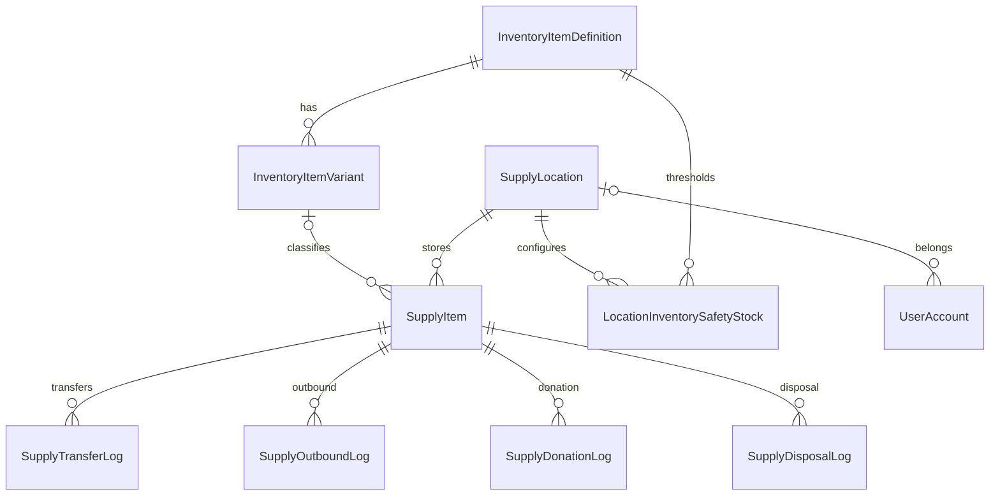

# 地方物資管理平台－資料庫與介面對照

最後更新：2026-08-09

## 資料表總覽

| 資料表 | 用途 | 主要介面 |
|---|---|---|
| `SupplyLocation` | 據點主檔 | 據點管理、地圖 |
| `InventoryItemDefinition` | 物資種類、名稱、單位、全系統門檻 | 庫存種類設定 |
| `InventoryItemVariant` | 物資規格 | 規格設定、新增物資 |
| `LocationInventorySafetyStock` | 各據點物資門檻 | 據點門檻 |
| `SupplyItem` | 據點內實際庫存批次 | 物資管理、Dashboard |
| `SupplyTransferLog` | 調撥紀錄 | 物資轉移、轉移紀錄 |
| `SupplyOutboundLog` | 出庫紀錄 | 出庫、領取分析 |
| `SupplyDonationLog` | 捐贈紀錄 | 捐贈管理 |
| `SupplyDisposalLog` | 報廢紀錄 | 報廢管理 |
| `UserAccount` | 帳號與角色 | 登入、帳號管理 |
| `LineNotificationSettings` | LINE 設定 | LINE 通知設定 |
| `AIStockInSettings` | AI API 設定 | AI 入庫設定 |
| `AIStockInLog` | AI 輸入與確認稽核 | AI 入庫紀錄 |

## 核心關聯



## 核心欄位

### `InventoryItemDefinition`

| 欄位 | 型別 | 說明 |
|---|---|---|
| `Id` | int identity | 主鍵 |
| `Category` | nvarchar(50) | 物資種類 |
| `ItemName` | nvarchar(100) | 物資名稱 |
| `Unit` | nvarchar(20) | 最小計算單位 |
| `GlobalSafetyStock` | int | 全系統安全庫存 |
| `IsActive` | bit | 啟用狀態 |
| `CreatedAt` | datetime | 建立時間 |
| `UpdatedAt` | datetime null | 更新時間 |

### `InventoryItemVariant`

| 欄位 | 型別 | 說明 |
|---|---|---|
| `Id` | int identity | 主鍵 |
| `InventoryItemDefinitionId` | int | FK → 物資定義 |
| `Specification` | nvarchar(200) null | 規格 |
| `IsActive` | bit | 啟用狀態 |
| `CreatedAt` | datetime | 建立時間 |
| `UpdatedAt` | datetime null | 更新時間 |

### `LocationInventorySafetyStock`

| 欄位 | 型別 | 說明 |
|---|---|---|
| `Id` | int identity | 主鍵 |
| `LocationId` | int | FK → 據點 |
| `InventoryItemDefinitionId` | int | FK → 物資定義 |
| `SafetyStock` | int | 據點安全庫存 |
| `CreatedAt` | datetime | 建立時間 |
| `UpdatedAt` | datetime null | 更新時間 |

### `SupplyItem`

| 欄位 | 型別 | 說明 |
|---|---|---|
| `Id` | int identity | 主鍵 |
| `Category` | nvarchar(50) | 種類快照 |
| `ItemName` | nvarchar(100) | 名稱快照 |
| `Specification` | nvarchar(200) null | 規格快照 |
| `Quantity` | int | 目前庫存 |
| `Unit` | nvarchar(20) null | 最小單位快照 |
| `StockType` | nvarchar(20) | NoExpiry / HasExpiry / Frozen |
| `ExpirationDate` | date null | 有效期限 |
| `ImagePath` | nvarchar(300) null | 圖片相對路徑 |
| `InventoryItemVariantId` | int null | FK → 新規格主檔 |
| `LocationId` | int | FK → 據點 |
| `SafetyStock` | int | 舊版相容欄位 |
| `Remark` | nvarchar(300) null | 備註 |
| `IsActive` | bit | 軟刪除狀態 |
| `CreatedAt` | datetime | 建立時間 |
| `UpdatedAt` | datetime null | 更新時間 |

## 異動紀錄共通概念

- `SupplyTransferLog`：來源、目的、數量、Pending/Confirmed/Cancelled、操作人與確認人。
- `SupplyOutboundLog`：物資、據點、數量、領取人、聯絡方式與時間。
- `SupplyDonationLog`：物資、據點、數量、捐贈者、聯絡方式與時間。
- `SupplyDisposalLog`：物資、據點、數量、原因與時間。

所有異動表以 FK 連到 `SupplyItem` 與 `SupplyLocation`，刪除行為為 Restrict。

## 介面與資料表

| 功能 | 讀取 | 寫入 |
|---|---|---|
| 戰情總覽 | 定義、規格、據點門檻、物資 | 無 |
| 庫存種類設定 | 定義、規格、據點 | 定義、規格、據點門檻 |
| 新增物資 | 定義、規格、據點門檻 | SupplyItem |
| 調撥 | 物資、據點 | SupplyTransferLog、SupplyItem |
| 出庫 | 物資、據點 | SupplyOutboundLog、SupplyItem |
| 捐贈 | 物資、據點 | SupplyDonationLog、SupplyItem |
| 報廢 | 物資、據點 | SupplyDisposalLog、SupplyItem |
| 帳號管理 | UserAccount、SupplyLocation | UserAccount |

## 警示計算

```text
據點目前數量 = SUM(Quantity) BY Location + Definition
全系統目前數量 = SUM(Quantity) BY Definition
```

- 規格不拆分安全庫存。
- 全系統目前數量不包含調撥中數量。
- 門檻為 0 不產生警示。
- 即期與過期按 SupplyItem 個別期限判斷。

## 舊版相容

過渡表 `InventoryTypeSetting` 與 `SupplyItem.InventoryTypeSettingId` 已於 2026-08 移除（確認為 0 筆、無任何 Controller/Service/View 讀寫後刪除，詳見 `ResourceSharingPlatform_dev_spec.md` 10.1）。既有安裝升級時 `DbInitializer.EnsureInventoryCatalogTablesAsync` 會自動 DROP 掉殘留的表／欄位。
