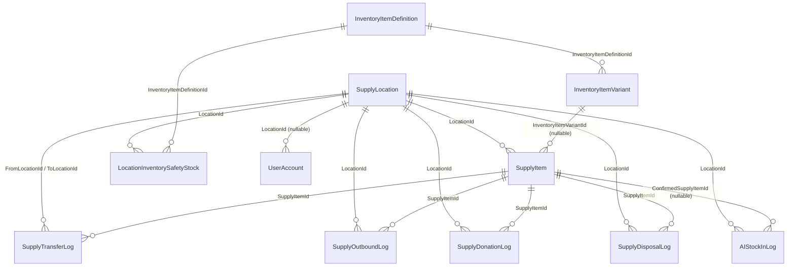

# 地方物資管理平台 — 資料串接參考文件

給要跟本系統串接資料的工程師看的獨立文件。目的是讓你不用讀過整個 repo 也能知道：資料庫長什麼樣子、怎麼連、資料代表什麼意思、有哪些坑要注意。

最後更新：2026-08-12(部署站台資訊已依實際狀態更正,詳見 [IISDeployment.md](IISDeployment.md);原對應 repo tag [v1.9.0](https://github.com/bill1114/ResourceSharingPlatform/releases/tag/v1.9.0))

---

## 1. 系統概觀

- ASP.NET Core MVC（.NET 8）+ Entity Framework Core 8 + SQL Server，Razor 伺服器端渲染，**沒有 REST/JSON API**——目前唯一能串接資料的方式是**直接連 SQL Server 資料庫**（見第 2 節）。
- 兩套並存的部署，共用同一個資料庫：
  - 開發用 Kestrel：`http://localhost:5140`（`Start.bat`/`Stop.bat` 啟停）
  - IIS 正式站：`http://192.168.0.151:5000`（App Pool `ResourceSharingPlatform`），2026-08-12 起已對外開放，外部網址 `http://122.117.44.214:5000/`（詳見 [IISDeployment.md](IISDeployment.md)，公網 IP 可能是動態的）
- 認證方式：Cookie Authentication，帳號密碼存在 `UserAccount` 表（雜湊過，非明文）。沒有 API Token/OAuth 機制。
- 資料庫名稱：`LocalSupplyDB`，SQL Server Express。

## 2. 資料庫連線方式（⚠️ 目前僅限本機，未對外開放）

| 項目 | 值 |
|---|---|
| SQL Server 執行個體 | `USER\SQLEXPRESS`（2026-08-12 確認；機器名稱先前改過好幾次，若又不一樣了，以 `SELECT @@SERVERNAME` 查到的實際值為準） |
| 資料庫 | `LocalSupplyDB` |
| 認證方式 | Windows 整合驗證（`Trusted_Connection=True`），本機應用程式使用的連線字串：`Server=.;Database=LocalSupplyDB;Trusted_Connection=True;TrustServerCertificate=True;` |
| SQL Server 版本 | Express Edition，15.0.2160.4（SQL Server 2019） |

**目前的限制，串接前務必先確認清楚：**

- SQL Server 的 TCP/IP 雖然有開（監聽 1433），但 **Windows 防火牆沒有對應的放行規則**，實際上外部機器連不進來，這點目前仍維持刻意限制本機的狀態——**不要跟網站本身混為一談**：網站（IIS 站台）2026-08-12 起已對外開放（見 [IISDeployment.md](IISDeployment.md)），但資料庫本身並沒有跟著對外開放，兩者是分開的防火牆規則。
- `SQLBrowser` 服務也是停用的，所以就算防火牆開了，用執行個體名稱（`主機\SQLEXPRESS`）連線也不會自動解析，得直接指定連接埠 `1433`。
- 如果另一位工程師需要**從別台機器**直接連這個資料庫，需要額外做：開防火牆規則、視情況啟用 SQL 登入驗證（目前只有 Windows 整合驗證，且這台機器不在網域，遠端機器很可能沒有對應的 Windows 帳號可用）、以及評估這樣做的資安風險。**這些改動本身有風險，需要跟我明確討論後才會進行**，這份文件先假設對方是透過匯出/複本資料庫，或在同一台機器上開發來串接。
- 比較安全、建議的替代方案：
  1. 定期用 `Backups\` 資料夾裡的 `.bak` 備份（見 [BackupPlan.md](BackupPlan.md)，每週自動產生）還原到另一台機器的 SQL Server 做開發/串接，不動到正式資料庫。
  2. 或請他要哪些資料表/欄位，我用 `bcp`／`sqlcmd` 匯出 CSV 給他，不用直接連正式庫。

## 3. 資料表總覽

| 資料表 | 用途 | 目前筆數* |
|---|---|---|
| `SupplyLocation` | 據點主檔 | 4 |
| `InventoryItemDefinition` | 物資目錄：種類＋名稱＋單位＋全系統安全庫存＋庫存分類 | 10 |
| `InventoryItemVariant` | 物資規格（同一種類名稱下的不同規格） | 10 |
| `LocationInventorySafetyStock` | 各據點對每種物資的安全庫存門檻 | 22 |
| `SupplyItem` | **核心表**：據點內實際庫存批次 | 28 |
| `SupplyTransferLog` | 據點間調撥紀錄 | 23 |
| `SupplyOutboundLog` | 出庫（領用）紀錄 | 12 |
| `SupplyDonationLog` | 捐贈入庫紀錄 | 2 |
| `SupplyDisposalLog` | 報廢／損耗紀錄 | 2 |
| `UserAccount` | 帳號與角色 | 4 |
| `LineNotificationSettings` | LINE 通知設定（單筆設定列，目前功能是 mock，未真的串 LINE API） | 1 |
| `AIStockInSettings` | AI 智慧入庫 API 設定（單筆設定列） | 1 |
| `AIStockInLog` | AI 智慧入庫的辨識輸入與確認紀錄 | 2 |

\* 筆數是查詢當下（2026-08-09）的快照，僅供了解資料量級參考，會持續變動。

### 關聯圖

`SupplyItem` 是串接資料時最常會用到的表——它是「某個據點、某項物資、某個規格、某個效期批次」目前實際庫存的那一列。`InventoryItemDefinition`／`InventoryItemVariant` 則是「這個系統裡存在哪些物資種類/名稱/規格」的目錄主檔，兩者關係見第 5 節。

## 4. 完整欄位定義

型別後面若標 `snapshot`，代表這欄位是「建立當下複製過來的快照值」，不是即時關聯查詢——之後若在目錄主檔改了種類名稱，這裡舊紀錄仍保留當時輸入的文字，這是刻意設計（保留歷史紀錄原貌），不是資料不同步的 bug。

### SupplyLocation（據點主檔）

| 欄位 | 型別 | 可為Null | 預設值 | 說明 |
|---|---|---|---|---|
| Id | int, identity | 否 | | PK |
| LocationName | nvarchar(200) | 否 | | 據點名稱 |
| Address | nvarchar(400) | 是 | | 地址 |
| Latitude | decimal(10,7) | 是 | | 緯度（地圖用） |
| Longitude | decimal(10,7) | 是 | | 經度（地圖用） |
| ContactPerson | nvarchar(100) | 是 | | 聯絡人 |
| Phone | nvarchar(60) | 是 | | 電話 |
| IsActive | bit | 否 | 1 | 軟刪除狀態 |
| CreatedAt | datetime | 否 | getdate() | |
| UpdatedAt | datetime | 是 | | |

### InventoryItemDefinition（物資目錄：種類＋名稱）

| 欄位 | 型別 | 可為Null | 預設值 | 說明 |
|---|---|---|---|---|
| Id | int, identity | 否 | | PK |
| Category | nvarchar(100) | 否 | | 物資種類，例如「食品」 |
| ItemName | nvarchar(200) | 否 | | 物資名稱，例如「飲用水」 |
| Unit | nvarchar(40) | 否 | | 最小計算單位，例如「瓶」 |
| GlobalSafetyStock | int | 否 | 0 | 全系統安全庫存（>=0） |
| IsActive | bit | 否 | 1 | 啟用中的 Category+ItemName 不可重複（見唯一索引） |
| CreatedAt | datetime | 否 | getdate() | |
| UpdatedAt | datetime | 是 | | 一旦有值，代表管理者手動存過檔，系統的自動回填邏輯不會再覆蓋 |
| StockType | nvarchar(40) | 否 | 'HasExpiry' | 庫存分類，值域見第 6 節 |

唯一索引：`(Category, ItemName) WHERE IsActive = 1`

### InventoryItemVariant（物資規格）

| 欄位 | 型別 | 可為Null | 預設值 | 說明 |
|---|---|---|---|---|
| Id | int, identity | 否 | | PK |
| InventoryItemDefinitionId | int | 否 | | FK → InventoryItemDefinition.Id |
| Specification | nvarchar(400) | 是 | | 規格，例如「600ml」「XL」，NULL 代表無規格 |
| IsActive | bit | 否 | 1 | |
| CreatedAt | datetime | 否 | getdate() | |
| UpdatedAt | datetime | 是 | | |

唯一索引：`(InventoryItemDefinitionId, Specification) WHERE IsActive = 1`

### LocationInventorySafetyStock（據點安全庫存門檻）

| 欄位 | 型別 | 可為Null | 預設值 | 說明 |
|---|---|---|---|---|
| Id | int, identity | 否 | | PK |
| LocationId | int | 否 | | FK → SupplyLocation.Id |
| InventoryItemDefinitionId | int | 否 | | FK → InventoryItemDefinition.Id |
| SafetyStock | int | 否 | 0 | 該據點對該物資的安全庫存門檻（>=0） |
| CreatedAt | datetime | 否 | getdate() | |
| UpdatedAt | datetime | 是 | | |

唯一索引：`(LocationId, InventoryItemDefinitionId)`

### SupplyItem（核心表：據點內實際庫存批次）

| 欄位 | 型別 | 可為Null | 預設值 | 說明 |
|---|---|---|---|---|
| Id | int, identity | 否 | | PK |
| Category | nvarchar(100) | 否 | | 種類（snapshot） |
| ItemName | nvarchar(200) | 否 | | 名稱（snapshot） |
| Specification | nvarchar(400) | 是 | | 規格（snapshot） |
| Quantity | int | 否 | 0 | **目前庫存量，會隨出庫/調撥/報廢/捐贈即時增減** |
| Unit | nvarchar(40) | 是 | | 單位（snapshot） |
| StockType | nvarchar(40) | 否 | 'HasExpiry' | 庫存分類，值域見第 6 節 |
| ExpirationDate | date | 是 | | 有效期限；StockType=NoExpiry 時通常為 NULL |
| ImagePath | nvarchar(600) | 是 | | 圖片相對路徑，例如 `/uploads/items/食品-飲用水-600ml-250-20260809-001.png`，見第 7 節 |
| InventoryItemVariantId | int | 是 | | FK → InventoryItemVariant.Id，關聯回目錄主檔 |
| LocationId | int | 否 | | FK → SupplyLocation.Id |
| SafetyStock | int | 否 | 0 | **舊版快照欄位**，實際警示邏輯已改用 `LocationInventorySafetyStock`，這欄位不要當作目前門檻的真實來源 |
| Remark | nvarchar(600) | 是 | | |
| IsActive | bit | 否 | 1 | 軟刪除狀態 |
| CreatedAt | datetime | 否 | getdate() | |
| UpdatedAt | datetime | 是 | | |

索引：`Category`、`LocationId`、`InventoryItemVariantId`、`StockType`（皆非唯一）

### SupplyTransferLog（據點間調撥紀錄）

| 欄位 | 型別 | 可為Null | 預設值 | 說明 |
|---|---|---|---|---|
| Id | int, identity | 否 | | PK |
| SupplyItemId | int | 否 | | FK → SupplyItem.Id（來源批次） |
| FromLocationId | int | 否 | | FK → SupplyLocation.Id |
| ToLocationId | int | 否 | | FK → SupplyLocation.Id |
| TransferQuantity | int | 否 | | 調撥數量（>0） |
| TransferTime | datetime | 否 | getdate() | |
| Operator | nvarchar(100) | 是 | | |
| Remark | nvarchar(600) | 是 | | |
| BatchId | uniqueidentifier | 否 | newid() | |
| Status | nvarchar(40) | 否 | 'Pending' | 值域見第 6 節 |
| ConfirmedBy | nvarchar(100) | 是 | | |
| ConfirmedAt | datetime | 是 | | |

流程：建立時扣來源庫存並標記 `Pending`；目的據點確認收貨時增加目的庫存、改 `Confirmed`；取消時退回來源庫存、改 `Cancelled`。

### SupplyOutboundLog（出庫／領取紀錄）

| 欄位 | 型別 | 可為Null | 預設值 | 說明 |
|---|---|---|---|---|
| Id | int, identity | 否 | | PK |
| SupplyItemId | int | 否 | | FK → SupplyItem.Id |
| LocationId | int | 否 | | FK → SupplyLocation.Id |
| OutboundQuantity | int | 否 | | 出庫數量（>0） |
| RecipientName | nvarchar(100) | 否 | | 領用人姓名 |
| RecipientContact | nvarchar(100) | 是 | | |
| Operator | nvarchar(100) | 是 | | |
| OutboundTime | datetime | 否 | getdate() | |
| Remark | nvarchar(600) | 是 | | |

### SupplyDonationLog（捐贈入庫紀錄）

| 欄位 | 型別 | 可為Null | 預設值 | 說明 |
|---|---|---|---|---|
| Id | int, identity | 否 | | PK |
| SupplyItemId | int | 否 | | FK → SupplyItem.Id（增加到哪個既有批次） |
| LocationId | int | 否 | | FK → SupplyLocation.Id |
| DonationQuantity | int | 否 | | 捐贈數量 |
| DonorName | nvarchar(100) | 否 | | 捐贈者姓名 |
| DonorContact | nvarchar(100) | 是 | | |
| Operator | nvarchar(100) | 是 | | |
| DonationTime | datetime | 否 | getdate() | |
| Remark | nvarchar(600) | 是 | | |

### SupplyDisposalLog（報廢／損耗紀錄）

| 欄位 | 型別 | 可為Null | 預設值 | 說明 |
|---|---|---|---|---|
| Id | int, identity | 否 | | PK |
| SupplyItemId | int | 否 | | FK → SupplyItem.Id |
| LocationId | int | 否 | | FK → SupplyLocation.Id |
| DisposalQuantity | int | 否 | | 報廢數量 |
| Reason | nvarchar(40) | 否 | 'Other' | 值域見第 6 節 |
| Operator | nvarchar(100) | 是 | | |
| DisposalTime | datetime | 否 | getdate() | |
| Remark | nvarchar(600) | 是 | | |

### UserAccount（帳號）

| 欄位 | 型別 | 可為Null | 預設值 | 說明 |
|---|---|---|---|---|
| Id | int, identity | 否 | | PK |
| UserName | nvarchar(100) | 否 | | 唯一（唯一索引），登入帳號 |
| PasswordHash | nvarchar(600) | 否 | | ASP.NET Core `PasswordHasher` 格式的雜湊值，**不是明文，也不是一般 bcrypt/MD5**，不要假設能直接比對或還原 |
| DisplayName | nvarchar(100) | 是 | | |
| RoleName | nvarchar(60) | 否 | 'User' | 值域見第 6 節；DB 層沒有 CHECK 約束住這個值，是程式層驗證 |
| IsActive | bit | 否 | 1 | |
| CreatedAt | datetime | 否 | getdate() | |
| UpdatedAt | datetime | 是 | | |
| LocationId | int | 是 | | FK → SupplyLocation.Id；**NULL 代表不限據點**（通常是 Admin） |

### LineNotificationSettings（LINE 通知設定，單筆設定列）

| 欄位 | 型別 | 可為Null | 預設值 | 說明 |
|---|---|---|---|---|
| Id | int, identity | 否 | | PK |
| IsEnabled | bit | 否 | 0 | |
| ChannelAccessToken | nvarchar(600) | 是 | | **明文儲存**，尚未接 Secret Store |
| ChannelSecret | nvarchar(600) | 是 | | **明文儲存** |
| NotifyLowStock | bit | 否 | 1 | |
| NotifyExpiringSoon | bit | 否 | 1 | |
| NotifyExpired | bit | 否 | 1 | |
| UpdatedAt | datetime | 是 | | |
| UpdatedBy | nvarchar(100) | 是 | | |

⚠️ 目前這個功能只有設定畫面與資料表，**還沒有真的呼叫 LINE Messaging API**（mock 階段），串接資料時不要假設會實際發出通知。

### AIStockInSettings（AI 智慧入庫設定，單筆設定列）

| 欄位 | 型別 | 可為Null | 預設值 | 說明 |
|---|---|---|---|---|
| Id | int, identity | 否 | | PK |
| IsEnabled | bit | 否 | 0 | |
| ApiEndpoint | nvarchar(600) | 是 | | |
| ApiKey | nvarchar(600) | 是 | | **明文儲存** |
| SupportsImageInput | bit | 否 | 1 | |
| SupportsTextInput | bit | 否 | 1 | |
| UpdatedAt | datetime | 是 | | |
| UpdatedBy | nvarchar(100) | 是 | | |

### AIStockInLog（AI 智慧入庫辨識與確認紀錄）

| 欄位 | 型別 | 可為Null | 預設值 | 說明 |
|---|---|---|---|---|
| Id | int, identity | 否 | | PK |
| LocationId | int | 否 | | FK → SupplyLocation.Id |
| InputType | nvarchar(40) | 否 | 'Image' | `Image` 或 `Text` |
| InputText | nvarchar(1000) | 是 | | 文字輸入模式的原始文字 |
| InputImagePath | nvarchar(600) | 是 | | 拍照模式的原始照片路徑（GUID 檔名，尚未識別出物資，不套用第 7 節的命名規則） |
| SuggestedCategory | nvarchar(100) | 是 | | AI 建議的種類 |
| SuggestedItemName | nvarchar(200) | 是 | | AI 建議的名稱 |
| SuggestedSpecification | nvarchar(400) | 是 | | |
| SuggestedQuantity | int | 是 | | |
| SuggestedUnit | nvarchar(40) | 是 | | |
| SuggestedStockType | nvarchar(40) | 是 | | |
| SuggestedExpirationDate | date | 是 | | |
| SuggestedSafetyStock | int | 是 | | |
| SuggestedRemark | nvarchar(600) | 是 | | |
| Confidence | decimal(5,4) | 是 | | AI 辨識信心值 0.0000–1.0000 |
| RawResponse | nvarchar(max) | 是 | | AI API 原始回應（除錯用） |
| IsConfirmed | bit | 否 | 0 | 使用者是否已確認採用建議值入庫 |
| ConfirmedSupplyItemId | int | 是 | | FK → SupplyItem.Id，確認後對應到哪一筆庫存 |
| Operator | nvarchar(100) | 是 | | |
| CreatedAt | datetime | 否 | getdate() | |
| ConfirmedAt | datetime | 是 | | |

## 5. `SupplyItem` 與目錄主檔的關係（容易搞混的地方）

系統裡有兩層概念，串接資料時要分清楚：

1. **目錄主檔**（`InventoryItemDefinition` + `InventoryItemVariant`）：這系統「定義了哪些物資」。例如「食品／飲用水／600ml」是一種目錄項目，不管它現在庫存多少、放在哪個據點。
2. **實際庫存批次**（`SupplyItem`）：某個據點、某個目錄項目、某個效期的一筆實際庫存數量。同一個目錄項目可以在不同據點、不同效期各有好幾筆 `SupplyItem`。

`SupplyItem.InventoryItemVariantId` 是連回目錄主檔的關聯，但 `SupplyItem.Category/ItemName/Specification/Unit/StockType` 這幾欄同時也各自存了一份「建立當下」的快照值（見第 4 節開頭說明）。**如果要統計「這個系統目前總共有哪些物資、各多少庫存」，建議兩種方式擇一，不要混用：**

- 依目錄分組：`InventoryItemDefinition` JOIN `SupplyItem`（用 `InventoryItemVariantId` 或 `Category+ItemName`），可以拿到最新的種類/名稱/單位定義。
- 依快照分組：直接對 `SupplyItem.Category, SupplyItem.ItemName` 做 `GROUP BY`，拿到的是「當時輸入的文字」，可能跟目前目錄主檔的名稱不完全一致（例如目錄後來改名過）。

## 6. 字串欄位值域（enum 對照）

DB 裡這些欄位是 `nvarchar`，實際上是程式碼裡定義的固定字串常數，不是資料庫層的 enum type，也大多沒有 CHECK 約束（見第 8 節），串接時建議照這個值域做，不要自己編其他值：

**`StockType`**（`InventoryItemDefinition.StockType`、`SupplyItem.StockType`）

| 值 | 顯示名稱 |
|---|---|
| `NoExpiry` | 無效期物資 |
| `HasExpiry` | 有效期物資 |
| `Frozen` | 冷凍食品 |

**`RoleName`**（`UserAccount.RoleName`）

| 值 | 顯示名稱 |
|---|---|
| `Admin` | 管理人員（可跨據點） |
| `Cadre` | 幹部 |
| `SocialWorker` | 社工（限自己所屬據點） |

**`Reason`**（`SupplyDisposalLog.Reason`）

| 值 | 顯示名稱 |
|---|---|
| `Expired` | 過期 |
| `Damaged` | 損壞 |
| `Lost` | 遺失 |
| `Other` | 其他 |

**`Status`**（`SupplyTransferLog.Status`）

| 值 | 顯示名稱 |
|---|---|
| `Pending` | 待確認 |
| `Confirmed` | 已確認 |
| `Cancelled` | 已取消 |

**`InputType`**（`AIStockInLog.InputType`）

| 值 | 顯示名稱 |
|---|---|
| `Image` | 照片辨識 |
| `Text` | 文字描述 |

## 7. 圖片儲存

- 實體存放路徑由 `appsettings.json` 的 `UploadsRoot` 設定決定，目前指向 `D:\ResourceSharingPlatform\Pictures\`（兩個部署共用同一份，不是各自一份）。
  - 一般物資圖片：`Pictures\items\`
  - AI 智慧入庫的原始照片：`Pictures\ai-stockin\`
- 資料庫欄位（`SupplyItem.ImagePath`、`AIStockInLog.InputImagePath`）存的是**相對路徑**，格式 `/uploads/items/xxx.png`，不是絕對路徑，也不是二進位內容本身。要拿到實際圖片檔案，就是把這個相對路徑接到上面的實體路徑（`Pictures\` 去掉開頭的 `/uploads`），或如果對方能連到跑起來的網站，直接用 `http://localhost:5140/uploads/items/xxx.png` 這種 URL 存取（靜態檔案，不需要登入）。
- 一般物資圖片命名規則：`物資種類-物資名稱-規格-數量-日期-流水號`，例如 `食品-飲用水-600ml-250-20260809-001.png`。AI 智慧入庫的原始輸入照片維持隨機 GUID 檔名（因為拍照當下還沒辨識出是什麼物資）。

## 8. 給串接工程師的重要提醒

- **DB 層的資料完整性約束比想像中少**：目前只有 `InventoryItemDefinition.GlobalSafetyStock >= 0` 和 `LocationInventorySafetyStock.SafetyStock >= 0` 這兩個 CHECK 約束真的存在於資料庫裡。像 `SupplyItem.Quantity >= 0`、`RoleName` 的值域、`StockType` 的值域等等，都只有 C# 應用程式層在驗證，**直接寫 SQL 進去資料庫不會被擋下來**，串接時請自己在寫入端也做好這些檢查，不要假設資料庫會幫忙擋。
- `SupplyItem.SafetyStock` 是舊版遺留的快照欄位，**不是**目前安全庫存警示邏輯實際使用的來源，真正的門檻要查 `LocationInventorySafetyStock`（據點別）或 `InventoryItemDefinition.GlobalSafetyStock`（全系統）。
- 沒有 EF Core Migrations、沒有 rowversion 併發控制欄位——如果要同時寫入 `SupplyItem.Quantity`，請自己做好交易/鎖定，避免競態條件把庫存算錯。
- `SupplyItem.Quantity` 是「目前庫存」的即時餘額，不是不可變的異動明細；真正的異動軌跡要看 `SupplyTransferLog`／`SupplyOutboundLog`／`SupplyDonationLog`／`SupplyDisposalLog` 這幾張紀錄表，目前沒有統一的 InventoryTransaction Ledger 把所有異動彙整在一張表裡。
- `LineNotificationSettings`、`AIStockInSettings` 裡的金鑰/Token 欄位是明文儲存，串接或搬移資料時要注意不要外洩。
- 過渡表 `InventoryTypeSetting` 已於 2026-08 移除，如果你看到的是舊版文件或舊版資料庫備份，可能還會看到這張表，目前這個版本已經沒有了（詳見 [ResourceSharingPlatform_dev_spec.md](ResourceSharingPlatform_dev_spec.md) 10.1 節）。

## 9. 相關文件

- [ResourceSharingPlatform_dev_spec.md](ResourceSharingPlatform_dev_spec.md) — 完整開發規格（角色權限、安全庫存規則、資料庫版本策略等）
- [DatabaseSchemaAndUiMapping.md](DatabaseSchemaAndUiMapping.md) — 資料表與畫面功能的對照
- [IISDeployment.md](IISDeployment.md) — 部署與圖片儲存位置設定
- [BackupPlan.md](BackupPlan.md) — 資料庫與圖片的備份／還原方式
